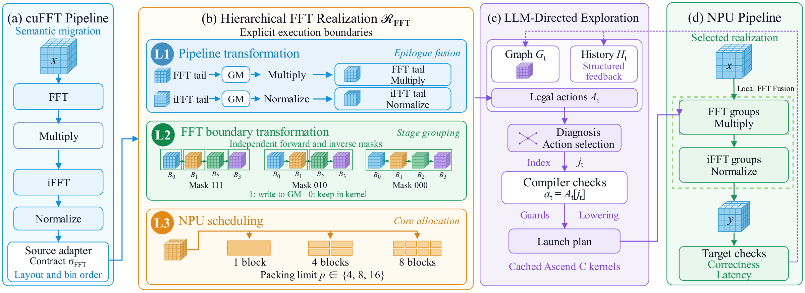
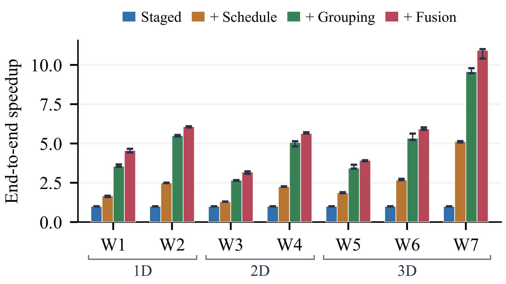

<p align="center">
  <picture>
    <source media="(prefers-color-scheme: dark)" srcset="assets/logo-dark.svg">
    <source media="(prefers-color-scheme: light)" srcset="assets/logo.svg">
    
  </picture>
</p>

[中文说明](README.zh-CN.md)

LLM-directed hierarchical FFT transformation and scheduling for CUDA-to-NPU migration.
Version **0.3.0**. Author and maintainer: **even**.

SAGE-FFT imports registered CUDA FFT pipelines into an FFT contract and stage IR.
The compiler checks grouping, epilogue fusion and core mapping, then emits Ascend C
sources and launch plans. An optional model selects legal transformations during
offline tuning; deployed FFT execution does not call the model.

## Overview

The FFT contract and stage IR connect epilogue fusion, stage grouping and core
mapping. The LLM selects from legal actions using target feedback; compiler
checks and target validation determine which execution plans are accepted.

<p align="center">
  <a href="assets/paper/figure2_overview.png"></a>
</p>

*Fig. 2 from the paper. The separate local-fusion extension goes beyond the
per-axis FP32 catalog.*

## Results from the paper

**Fewer launches at the same core allocation.** On Ascend 310P1, the FP32
8 × 8 × 8 weighted FFT pipeline drops from **20 to 6 launches** and from
**110.4 to 44.0 μs**, a **2.51× speedup**. Both NPU implementations use eight
AI Core blocks. Timings cover the complete resident-data pipeline.

**Structural gains across 1D, 2D and 3D workloads.** Stage grouping adds
**1.84–2.25×** beyond scheduling. The complete scheduling, grouping and fusion
tier reaches **3.18–10.93×** over the **one-block Staged baseline**; this total
includes the benefit of core allocation.

<p align="center">
  <a href="assets/paper/figure3_ablation.png"></a>
</p>

*Fig. 3 from the paper. Grouping supplies the largest structural gain beyond
scheduling. Click any figure to view the full-resolution image.*

<details>
<summary>Workloads and comparison conditions</summary>

| Cases | FFT shapes |
| --- | --- |
| W1, W2 (1D) | 64 and 256, each with batch 4 |
| W3, W4 (2D) | 8 × 16 and 16 × 32 |
| W5–W7 (3D) | 4 × 8 × 8, 8 × 8 × 8 and 8 × 16 × 16 |

These are FP32 measurements on Ascend 310P1. Fig. 1 and Fig. 3 come from
different timing studies: Fig. 1 fixes both implementations at eight blocks,
whereas Fig. 3 normalizes its cumulative tiers to a one-block Staged baseline.
Model inference and compilation are outside the reported target latency.
See the [reproduction guide](docs/REPRODUCIBILITY.md) for executable experiments.

</details>

## Install and test

Python 3.10 or newer is required. From this directory:

```bash
python -m venv .venv
source .venv/bin/activate
# Windows PowerShell: .venv\Scripts\Activate.ps1
python -m pip install -e ".[dev]"
python -m pytest
sage validate-cpu --shape 8,8,8
```

CPU tests use generated inputs and synthetic transport responses. They require
neither an accelerator nor an API key. CPU interpreter timings are not NPU timings.

## Generate a pipeline

```bash
sage emit-cuda --shape 8,8,8 --output runs/reference.cu
sage import-cuda runs/reference.cu
sage migrate runs/reference.cu --variant grouped --blocks 8 --output runs/migrated
sage emit-npu --shape 8,8,8 --variant staged --output runs/staged
sage emit-catalog --workload M3 --output runs/catalog
sage make-inputs --shape 8,8,8 --seed 1 --output runs/input_1
```

The adapter supports the registered literal cuFFT source family, not arbitrary
CUDA programs. The default FP32 3D staged plan uses 20 launches; grouping with
both epilogues uses six. The separate fixed-shape FP16 extension supports local
fusion and is outside the indexed FP32 catalog.

## Run on hardware

See [reproduction](docs/REPRODUCIBILITY.md), [native benchmarks](docs/NATIVE_BENCHMARKS.md)
and [model configuration](docs/LLM_CONFIGURATION.md). CANN, CUDA, model weights
and the optional MindSpore AI CPU plugin are installed separately.

```bash
python -m pip install -e ".[remote]"
# Export the applicable settings documented in .env.example first.
sage search runs/reference.cu --policy index --output runs/index_search
```

Use `--policy greedy` for the analytic control without a model. Searches perform
real target measurements; model-backed policies also contact the configured
service. Each user provides their own credentials through environment variables.
The `.env.example` file is documentation and is not loaded automatically.

## Layout

| Directory | Contents |
| --- | --- |
| `src/sage_fft/` | Contract, IR, compiler, search, model transport and analysis |
| `benchmarks/` | Native FP32/FP16 sources, input generators and study runners |
| `tests/` | Numerical, compiler, recovery and transport regression tests |
| `examples/` | Offline usage examples |
| `docs/` | Architecture, configuration and experiment instructions |
| `scripts/` | Source checks and audits of caller-generated results |

This source distribution includes selected paper figures, but no raw experiment
logs, model conversations, personal machine configuration or paper-version archives. Benchmark commands
create new results in the caller's configured workspace. Seeds do not guarantee
identical hosted-model decisions; report measured outcomes and failed proposals.

## Development

```bash
python -m ruff check src tests benchmarks scripts examples
python scripts/check_repository.py --strict-warnings
python -m build
```

The included GitHub Actions workflow runs CPU checks and builds the package.
Hardware measurements are separate. See [contributing](CONTRIBUTING.md),
[security](SECURITY.md) and [licensing status](LICENSING.md).
