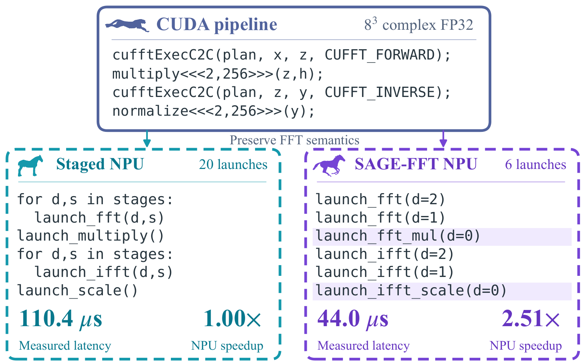

<p align="center">
  <picture>
    <source media="(prefers-color-scheme: dark)" srcset="assets/logo-dark.svg">
    <source media="(prefers-color-scheme: light)" srcset="assets/logo.svg">
    
  </picture>
</p>

[English](README.md)

版本 **0.3.0**，作者与维护者：**even**。

**论文状态：已投稿 ICASSP 2027。**

SAGE-FFT 将已注册的 CUDA FFT pipeline 导入 FFT contract 和 stage IR，
由编译器检查分组、尾部算子融合和核映射，再生成 Ascend C 源码与执行计划。
LLM 参与离线搜索，部署后的 FFT 执行不调用模型。

## 方法概览

FFT contract 和 stage IR 将尾部算子融合、阶段分组与核映射连接起来。
LLM 根据目标端反馈选择合法动作，编译器检查与目标端验证共同确定可接受的执行计划。

<p align="center">
  <a href="assets/paper/figure2_overview.png"></a>
</p>

*论文 Fig. 2。独立的局部融合扩展进一步突破逐轴 FP32 实现目录的边界。*

## 论文结果展示

**相同核数下减少启动次数。** 在 Ascend 310P1 上，FP32 的 8 × 8 × 8
加权 FFT 流水线从 **20 次启动降为 6 次**，延迟从 **110.4 μs 降至 44.0 μs**，
获得 **2.51× 加速**。两种 NPU 实现均使用八个 AI Core blocks，计时覆盖数据驻留设备上的完整流水线。

<p align="center">
  <a href="assets/paper/figure1_motivation.png"></a>
</p>

*论文 Fig. 1。CUDA 提供源流水线，图中加速比比较的是同一台 NPU 上的两种实现。*

**1D、2D、3D 工作负载中的结构优化收益。** 阶段分组在调度优化之上进一步带来
**1.84–2.25×** 加速。调度、分组与融合全部启用后，相对**单核 Staged 基线**
达到 **3.18–10.93×**；这一总加速比包含核分配带来的收益。

<p align="center">
  <a href="assets/paper/figure3_ablation.png"></a>
</p>

*论文 Fig. 3。阶段分组提供了调度之外最大的结构收益。点击图片可查看高清版本。*

<details>
<summary>工作负载与比较口径</summary>

| 用例 | FFT 形状 |
| --- | --- |
| W1、W2（1D） | 64 和 256，batch 均为 4 |
| W3、W4（2D） | 8 × 16 和 16 × 32 |
| W5–W7（3D） | 4 × 8 × 8、8 × 8 × 8 和 8 × 16 × 16 |

上述结果均为 Ascend 310P1 上的 FP32 测量。Fig. 1 与 Fig. 3 来自不同计时实验：
Fig. 1 将两种实现固定在八核，Fig. 3 则将各优化层级归一化到单核 Staged 基线。
目标端延迟不包含模型推理和编译时间。可执行实验见[复现指南](docs/REPRODUCIBILITY.md)。

</details>

## 安装与测试

需要 Python 3.10 或以上版本。在当前目录执行：

```bash
python -m venv .venv
# Linux/macOS: source .venv/bin/activate
# Windows PowerShell: .venv\Scripts\Activate.ps1
python -m pip install -e ".[dev]"
python -m pytest
sage validate-cpu --shape 8,8,8
sage emit-cuda --shape 8,8,8 --output runs/reference.cu
sage migrate runs/reference.cu --variant grouped --blocks 8 --output runs/migrated
```

CPU 测试使用生成输入和合成响应，不需要服务器或 API Key。
CUDA 导入器支持已注册的 cuFFT 源码结构，不是通用 CUDA 编译器。

## 真机与模型配置

参见[复现指南](docs/REPRODUCIBILITY.md)、[原生基准](docs/NATIVE_BENCHMARKS.md)
和[模型 API 配置](docs/LLM_CONFIGURATION.md)。按 `.env.example` 导出自己的环境变量，
安装 CANN、CUDA 或相应模型运行时后执行实验。配置文件不会自动加载。
SiliconFlow API Key 由每个使用者自行提供，不写入源码。

纯净版保留源码、测试、输入生成器、复现说明和精选论文图，不包含原始实验日志、模型对话、
论文迭代记录、个人路径或机器配置。实验会在新工作目录生成自己的结果；
大模型决策和硬件计时存在波动，应保留真实结果与失败记录。

源码目录结构见英文 README。许可状态见 [LICENSING.md](LICENSING.md)。
